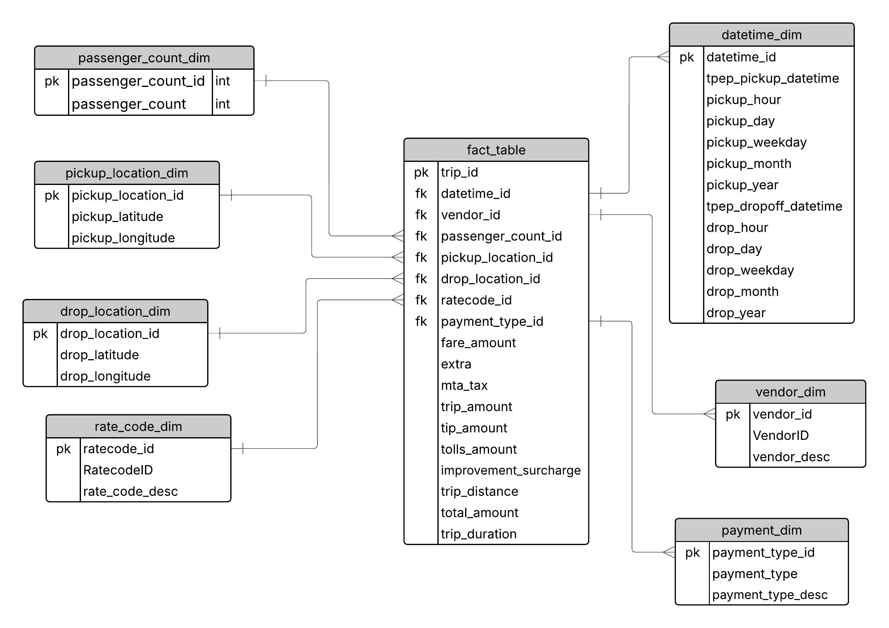

# 🚕 Uber Data Analytics & Machine Learning Pipeline | GCP + Mage

## 📌 Overview

This project demonstrates how to build a **modern data pipeline and machine learning system** using Uber trip data. The pipeline is powered by **Google Cloud Platform (GCP)** and **Mage.ai**, a modern open-source data orchestration tool.

We ingest raw data, transform it using BigQuery, visualize insights in Looker Studio, and apply machine learning to predict metrics like **fare**, **trip duration**, and **tips**. This project bridges **analytics** with **AI-powered decision-making**.

---

## 🧱 Architecture


---

## ⚙️ Tech Stack

### 💻 Programming

- **Python**
- **SQL**

### ☁️ Google Cloud Platform
- **Cloud Storage** – stores raw and processed data
- **Compute Engine** – hosts Mage pipeline orchestration
- **BigQuery** – performs scalable SQL transformations
- **Looker Studio** – builds insightful dashboards

### 🧪 ML/DS Libraries
- **scikit-learn**
- **XGBoost**
- **pandas**
- **NumPy**

### 🧩 Data Orchestration
- [Mage.ai](https://www.mage.ai/) – modern alternative to Airflow  
  → GitHub: [mage-ai/mage-ai](https://github.com/mage-ai/mage-ai)
---

## 📁 Dataset

We use **NYC TLC Trip Record Data** (Yellow Taxi), which includes:

- Pickup and dropoff timestamps and locations
- Trip distance
- Passenger count
- Fare, tips, surcharges
- Payment method and rate code

### 📌 Sources
- Dataset CSV: [uber_data.csv](https://raw.githubusercontent.com/OlawoyeTaofeek/Uber-Data-Engineering/refs/heads/main/data/uber_data.csv)
- Data portal: [NYC TLC Trip Data](https://www.nyc.gov/site/tlc/about/tlc-trip-record-data.page)
- [Data Dictionary (Yellow Taxi PDF)](https://www.nyc.gov/assets/tlc/downloads/pdf/data_dictionary_trip_records_yellow.pdf)

---

## 📐 Data Model

We use a **star schema** to structure the data for analytics:



### Fact Table
- `fact_trips`: contains trip-level metrics (fare, duration, distance, etc.)

### Dimension Tables
- `dim_time`: pickup/dropoff timestamps and attributes
- `dim_vendor`: taxi vendor ID and name
- `dim_passenger_count`: passenger counts
- `dim_rate_code`: fare rate categories
- `dim_payment_type`: payment methods
- `dim_pickup_location` / `dim_dropoff_location`: coordinates

---

## 📊 Dashboards (Looker Studio)

We built interactive dashboards to visualize key trends:
- Total revenue over time
- Popular pickup/dropoff locations
- Average fare per distance
- Tip patterns by payment type and vendor
- Weekly and hourly ridership trends

---

## 🔮 Machine Learning Extension

We extended the analytics pipeline with a full ML pipeline to **predict key metrics** such as fare and trip duration, and classify tip/no-tip scenarios.

### ✅ Use Cases
| ML Task                      | Target Variable       | Model Type     |
|-----------------------------|------------------------|----------------|
| Predict trip fare           | `fare_amount`          | Regression     |
| Predict trip duration       | `trip_duration`        | Regression     |
| Predict tip amount          | `tip_amount`           | Regression     |
| Tip or no-tip classification| `tip_amount > 0`       | Classification |
| Predict payment type        | `payment_type`         | Classification |

### 🧠 ML Pipeline
1. Flattened star-schema data into ML-ready format
2. Engineered features: hour, weekday, location clusters, fare/mile
3. Encoded categorical variables
4. Trained baseline models (RandomForest, XGBoost, LogisticRegression)
5. Evaluated using MAE, RMSE, R²
6. Deployed model using Fast API or GCP Vertex AI

---

## 📁 Project Structure
```text
uber-data-project/
│
├── README.md
├── requirements.txt
├── .env                      # GCP or BigQuery credentials
|__ .gitignore 
|__ .architecture.jpg        # Project Architecture
|__ data_model.jpeg          # Star schema modeling             
│
├── data/                      # Raw or local CSVs
│   └── uber_data.csv
│
├── notebooks/                 # EDA & prototyping
│   └── eda.ipynb
│
├── pipeline/                  # Mage pipeline logic
│   ├── ingest_data.py
│   └── transform_data.py
│
├── analytics/                 # BigQuery SQL queries
│   └── bigquery.sql
│
├── ml_pipeline/               # Machine learning workflows
│   ├── feature_engineering.py
│   ├── train_model.py
│   ├── evaluate_model.py
│   ├── predict.py
│   └── model.pkl              # Trained model artifact
│
├── dashboard/                 # Looker Studio files or screenshots
│
├── deploy/                    # API or cloud deployment
│   └── fast_api.py           # Serve model via REST API
│
└── mage_ai_uber_project/           # Mage pipeline folder (auto-generated)
```

## 🤝 Contribution
You're welcome to fork this project, contribute new features, or extend the ML use cases. We also encourage contributions to Mage.ai:

🔗 [https://github.com/mage-ai/mage-ai](https://github.com/mage-ai/mage-ai)

---

## 📬 Contact

Built by Taofeek.  
For questions, issues, or suggestions, feel free to reach out or open an issue.